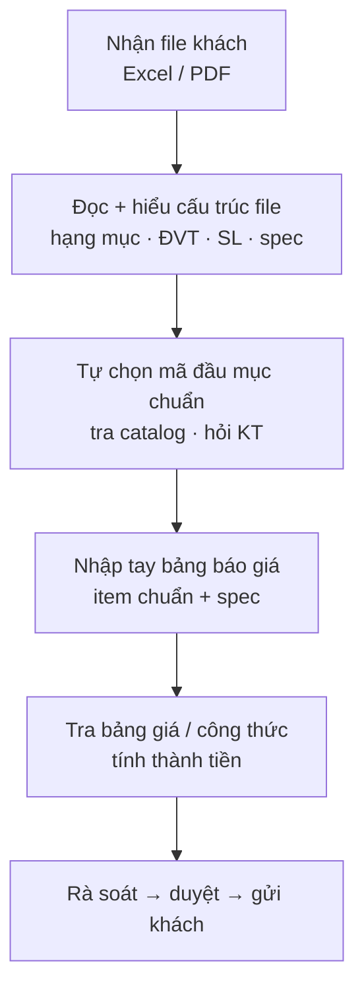
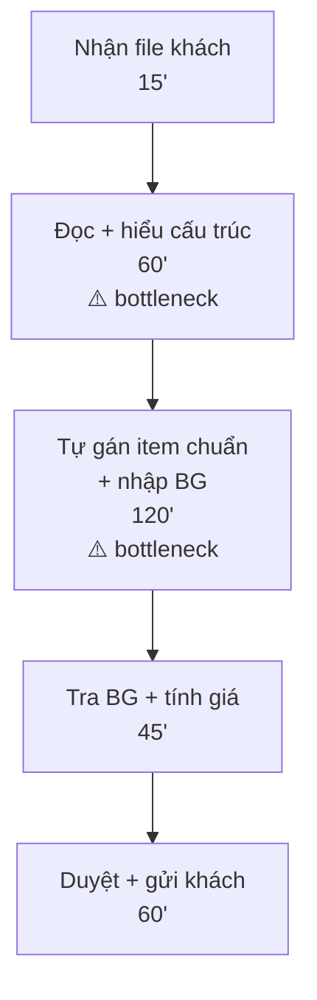
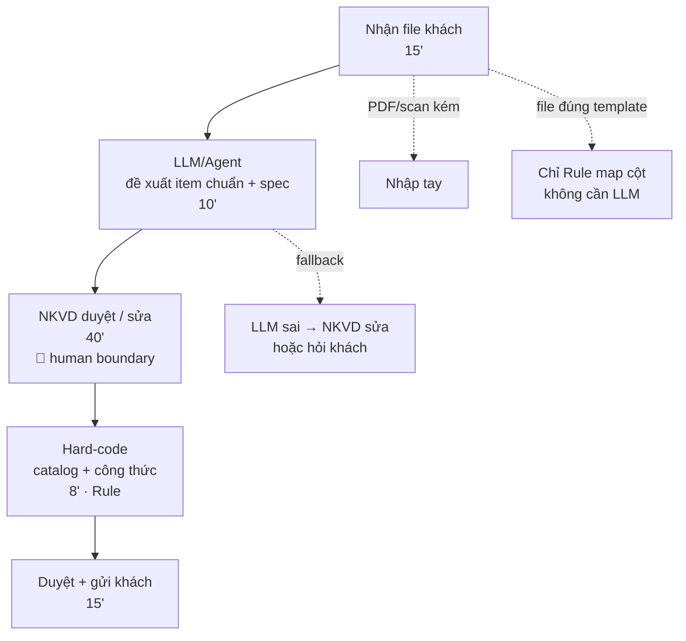
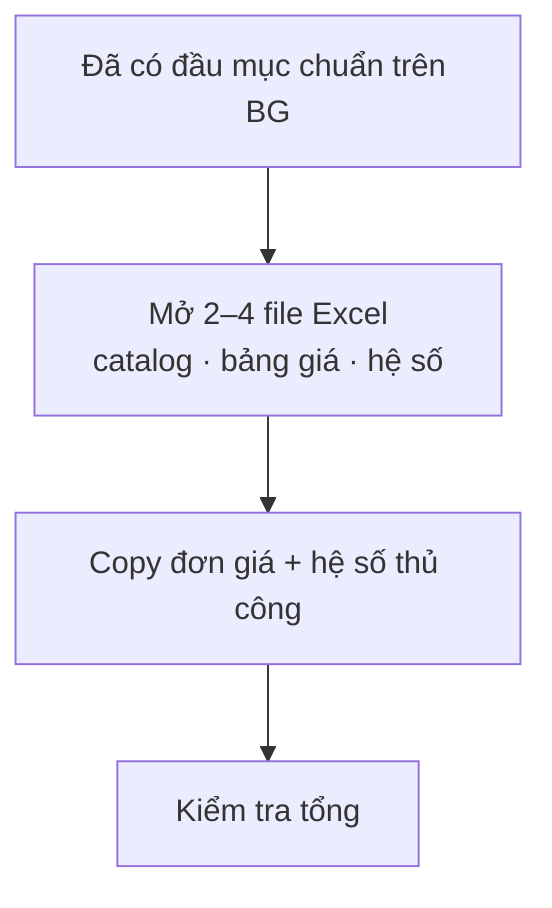
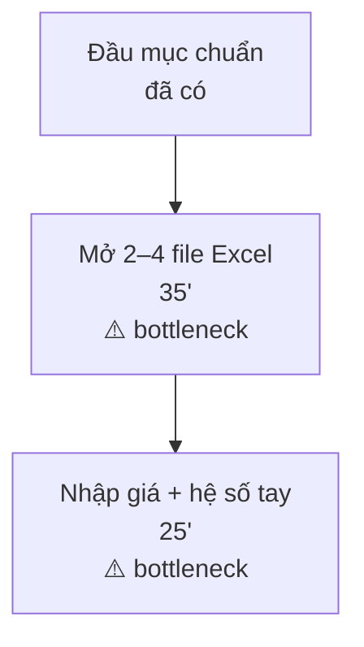
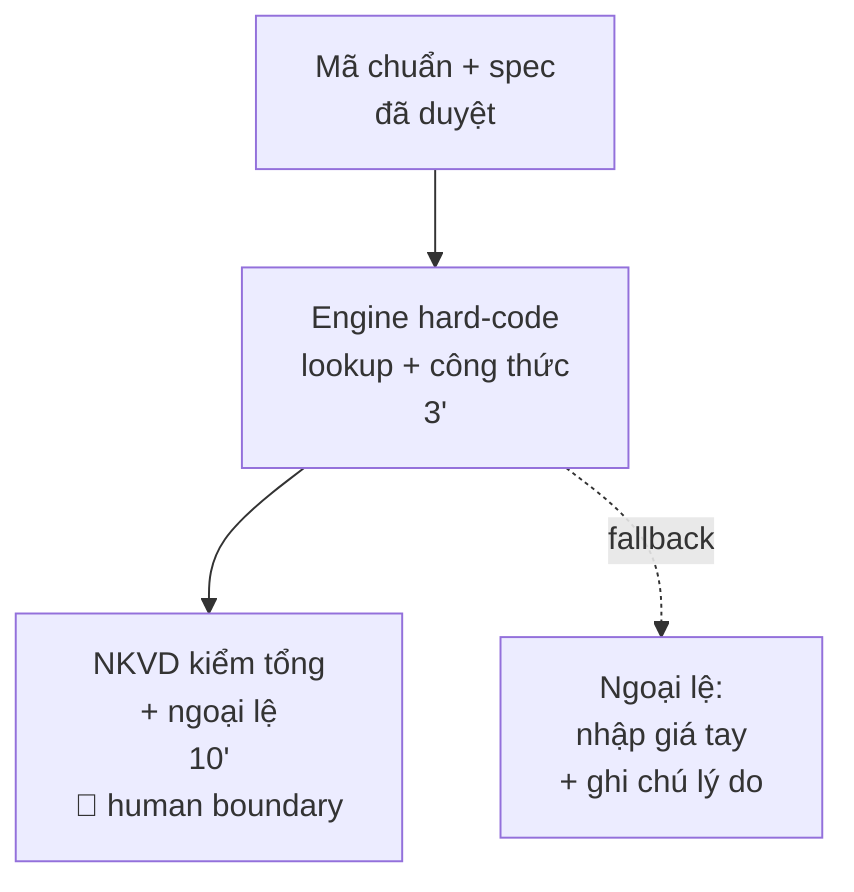
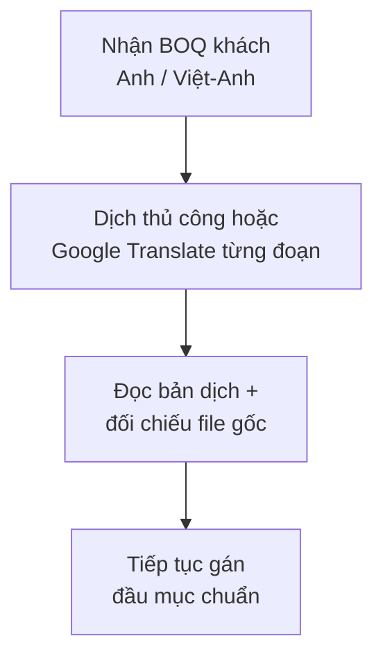
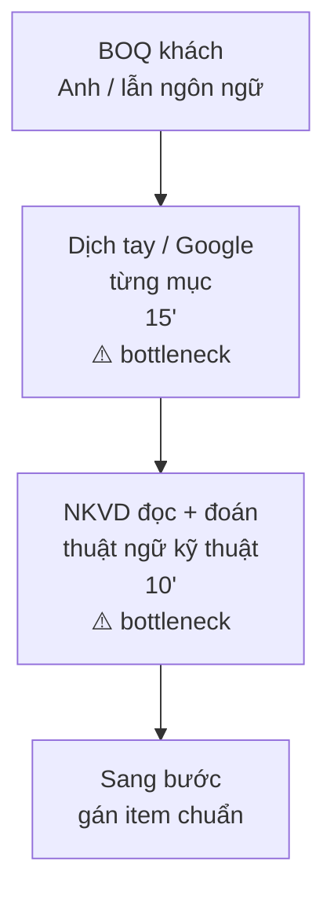
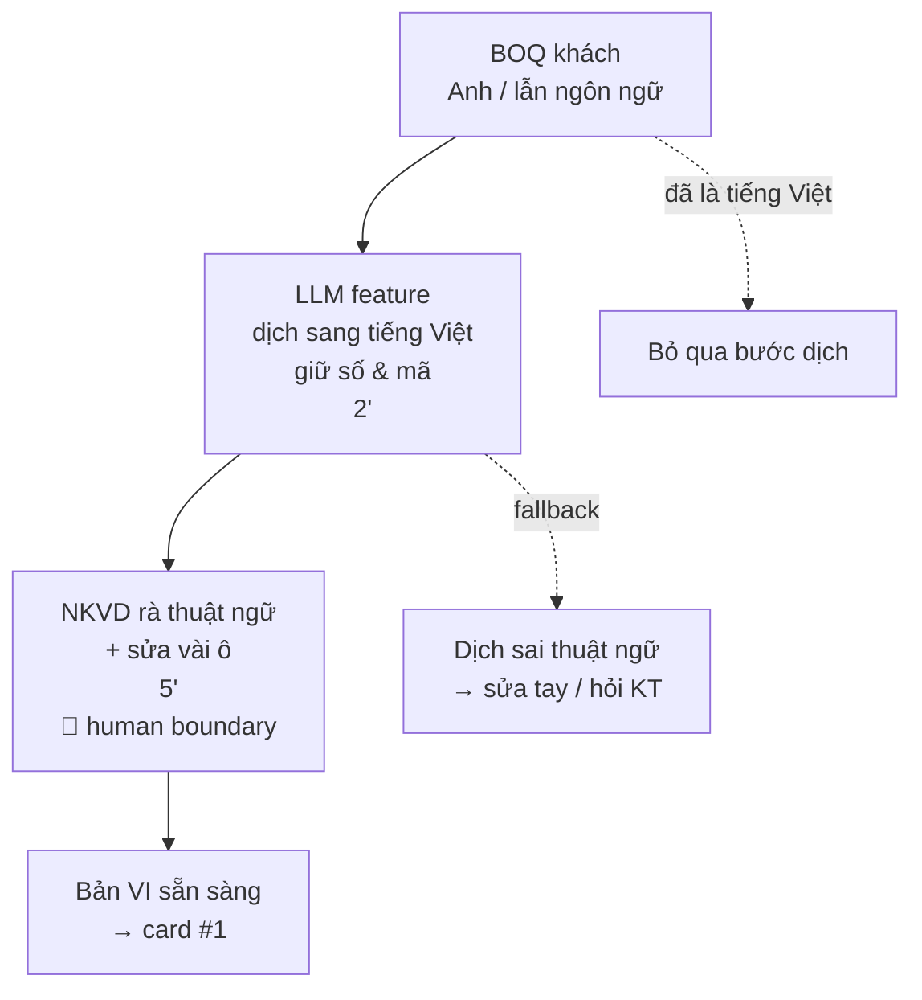

# 01 — Individual Problem Scan

## Thông tin

**Họ tên / Mã HV:** Vương Sỹ Hạnh - 2A202600722  
**Bối cảnh chính:** Nhóm **NKVD** (BKVN) — báo giá PCCC. Khách gửi BOQ/báo giá **mỗi nơi một kiểu**, không theo template thống nhất.

---

## Scan rộng

Scan **9 problems**.


| #   | Lăng kính                         | Problem quan sát được                                                                                                              | Ai đang đau?          | Dấu hiệu thật                                                                  |
| --- | --------------------------------- | ---------------------------------------------------------------------------------------------------------------------------------- | --------------------- | ------------------------------------------------------------------------------ |
| 1   | Tốn thời gian + AI có thể tốt hơn | File BOQ khách **không cấu trúc cố định** → NKVD tự bóc đầu mục, ĐVT, SL, thông số rồi **tự gán** danh mục chuẩn BKVN mới tính giá | Nhân viên NKVD        | 2–6 giờ/hồ sơ ~50–150 dòng; Excel riêng, không có bước sinh item chuẩn tự động |
| 2   | Lặp lại                           | Mỗi RFQ **layout khác** — không có quy tắc chung cho mọi file                                                                      | NKVD, kỹ thuật hỗ trợ | 5–15 file/tuần; ≥3 kiểu format khách / nhóm SP                                 |
| 3   | Pain từ người khác                | Trưởng nhóm trả báo giá vì **spec ≠ file khách** hoặc thiếu W×H, EI, vật liệu                                                      | Trưởng NKVD           | 20–30% nháp bị trả về; trễ gửi khách 1–2 ngày                                  |
| 4   | Lặp lại                           | Khách không dùng template chuẩn; gửi copy PDF/email                                                                                | NKVD, kinh doanh      | Template khách hầu như không điền đúng                                         |
| 5   | Tốn thời gian                     | **Tra catalog + bảng giá** trên nhiều file Excel nội bộ rời rạc                                                                    | NKVD                  | 30–60 phút/hồ sơ; hay tra nhầm bảng giá cũ                                     |
| 6   | AI có thể tốt hơn                 | BOQ khách **Anh/Việt lẫn** (hoặc toàn tiếng Anh) → NKVD mất thời gian dịch/đoán nghĩa trước khi gán mã chuẩn                       | NKVD                  | 15–30 phút/hồ sơ dịch thủ công; hay hiểu sai thuật ngữ PCCC (EI, FD, duct…)    |
| 7   | Tốn thời gian                     | Hai người cùng đọc file khách vì **sợ hiểu sai cấu trúc bảng**                                                                     | NKVD                  | ~40% hồ sơ lớn cần double-check                                                |
| 8   | Pain từ người khác                | Sản xuất nhận báo giá duyệt nhưng **spec nhập sai so với BOQ khách**                                                               | Sản xuất, PM          | Hiệu chỉnh sau chốt đơn (vài case/tháng)                                       |
| 9   | AI có thể tốt hơn                 | BOQ scan/PDF → gần như **đánh máy lại** toàn bộ                                                                                    | NKVD                  | ~10% hồ sơ; deadline gấp                                                       |


---

## Top 3


| Rank | Problem                              | Vì sao chọn                                                  | Điều còn chưa chắc                                                    |
| ---- | ------------------------------------ | ------------------------------------------------------------ | --------------------------------------------------------------------- |
| 1    | BOQ khách → đầu mục chuẩn + spec     | Workflow rõ, pain lớn nhất, nhiều format → **Agent/LLM**     | LLM gợi ý mã chuẩn hay bắt buộc khớp lookup cứng trước khi chấp nhận? |
| 2    | Tra catalog + tính công thức         | Tách khỏi LLM; **Rule/hard-code** dễ maintain                | Bao nhiêu % dòng vẫn cần nhập giá tay ngoại lệ?                       |
| 3    | BOQ đa ngôn ngữ → cần bản tiếng Việt | Gọi **LLM feature dịch** (Workflow), tách khỏi Agent card #1 | Thuật ngữ kỹ thuật dịch sai — ai chuẩn hóa từ điển PCCC?              |


---

## Problem Card #1 — BOQ khách → đầu mục chuẩn

**Problem 1 câu:**  
Mỗi lần NKVD nhận file BOQ Excel/PDF từ khách **không theo template chuẩn**, phải mất nhiều giờ **tự đọc file và tự tạo từng đầu mục chuẩn** (kèm thông số kỹ thuật) trên bảng báo giá nội bộ trước khi nhân đơn giá và gửi khách.

**Actor:**  
Nhân viên NKVD (báo giá / kỹ thuật thương mại).

**Thời điểm / bối cảnh:**  
RFQ mới — khách gửi email/Zalo/file đính kèm; NKVD mở file khách song song với file báo giá Excel nội bộ.

**Current workflow:**




**Bottleneck:**  
Bước 2–4 — bóc tách ngữ cảnh file khách và **sinh đầu mục chuẩn** dựa vào kinh nghiệm cá nhân của NVKD. Rule map cột (khi có app) chỉ đủ nếu file giống template; **không đủ** cho đa số file thực tế.

**Impact:**  
2–6 giờ/hồ sơ; 5–15 file/tuần; trễ deadline; sai spec → làm lại báo giá; duyệt và sản xuất chịu rủi ro downstream.

**Success metric:**  
Giảm thời gian từ file khách → bảng đầu mục chuẩn sẵn sàng duyệt: **3–4h → dưới 1h** (BOQ ~100 dòng). **≥85%** dòng LLM gợi ý đúng đầu mục + spec. Không tăng tỷ lệ báo giá trả về vì spec (giữ ≤20%).

**Non-AI alternative:**  
Ép khách dùng template BKVN. Rule cứng map cột → mã chuẩn (chỉ file đúng template). Hai người đối chiếu file khách ↔ báo giá trước duyệt.

**AI hypothesis:**  
**Agent + LLM** đọc file khách, đề xuất: mô tả khách | ĐVT | SL | thông số | đầu mục chuẩn BKVN | độ tin cậy. LLM **sinh item chuẩn** từ ngữ cảnh. Sau khi NKVD duyệt → tính giá bằng **engine hard-code** (card #2). Không tự gửi khách.

**Quick gut:**  
Agent.

**Lý do quick gut:**  
File khách cần hiểu layout và suy luận spec — không cố định. Rule/Workflow một bước không đủ vòng đọc lại. Agent: đọc file → đề xuất item chuẩn → NKVD duyệt → hard-code tính giá.

### Draft current workflow

*CURRENT — ~300 phút (BOQ ~100 dòng, file khách)*




### Draft future workflow

*FUTURE — ~80 phút*




---

## Problem Card #2 — Tra catalog + tính công thức

**Problem 1 câu:**  
Sau khi có đầu mục chuẩn, NKVD vẫn **tra danh mục và nhân giá thủ công** trên nhiều file Excel (bảng giá theo từng loại SP, vật liệu, đầu mục, hệ số vùng,...) — dễ sai, khó bảo trì khi đổi giá/công thức.

**Actor:**  
Nhân viên NKVD.

**Thời điểm / bối cảnh:**  
Sau bước chuẩn hóa đầu mục (card #1), trước gửi duyệt.

**Current workflow:**




**Bottleneck:**  
Bước 2–3 — chuyển qua lại nhiều file, dễ dùng nhầm bảng giá.

**Impact:**  
30–60 phút/hồ sơ; sai bảng giá → sai báo giá gửi khách.

**Success metric:**  
Thời gian tra + tính: **~45 phút → dưới 15 phút** (sau khi mã chuẩn đã trong hệ thống).

**Non-AI alternative:**  
Một file Excel tổng hợp — vẫn khó version và audit công thức.

**AI hypothesis:**  
**Không dùng LLM** cho tra catalog hay tính giá. **Rule/hard-code:** master data + engine công thức theo loại SP, vật liệu,... có version và test.

**Quick gut:**  
Rule.

**Lý do quick gut:**  
Input đã có mã chuẩn + spec — bài toán **lookup + công thức** xác định. Hard-code dễ maintain và kiểm thử hơn LLM khi công thức đổi theo quyết định nội bộ.

### Draft current workflow

*CURRENT — ~60 phút (phần tính giá)*




### Draft future workflow

*FUTURE — ~13 phút (phần tính giá)*




---

## Problem Card #3 — BOQ đa ngôn ngữ → dịch tiếng Việt

**Problem 1 câu:**  
Nhiều file BOQ khách gửi **tiếng Anh hoặc Việt/Anh lẫn**; NKVD phải **tự dịch hoặc đoán nghĩa** mô tả và thông số trước khi gán đầu mục chuẩn — dễ hiểu sai thuật ngữ kỹ thuật (EI, fire damper, duct size…).

**Actor:**  
Nhân viên NKVD (báo giá).

**Thời điểm / bối cảnh:**  
Ngay sau nhận file khách, **trước** bước bóc đầu mục chuẩn (card #1).

**Current workflow:**




**Bottleneck:**  
Bước 2–3 — dịch **không đồng nhất** (mỗi người một từ), thuật ngữ PCCC dễ sai; mất thời gian trên file dài.

**Impact:**  
15–30 phút/hồ sơ chỉ cho dịch; ~30–40% hồ sơ EPC/FDI có phần tiếng Anh; hiểu sai spec → sai mã chuẩn ở card #1.

**Success metric:**  
Thời gian có bản tiếng Việt sẵn sàng đọc: **~25 phút → dưới 5 phút** (LLM + rà nhanh). **≥95%** thuật ngữ kỹ thuật giữ đúng nghĩa sau khi NKVD rà (hoặc có glossary BKVN).

**Non-AI alternative:**  
Glossary thuật ngữ PCCC nội bộ (Excel) + ép khách gửi tiếng Việt. Không scale khi mỗi khách một kiểu viết.

**AI hypothesis:**  
**Workflow:** gọi **LLM feature dịch** (EN → VI, giữ số liệu W×H, SL, mã; không dịch số). Xuất bản **cột song song** hoặc sheet phụ tiếng Việt → NKVD rà thuật ngữ → mới vào bước Agent/card #1. **Không** dùng LLM dịch để tự chọn mã chuẩn hay tính giá.

**Quick gut:**  
Workflow.

**Lý do quick gut:**  
Một bước cố định: input file → output bản Việt. Không cần Agent (không tự quyết layout, không sinh item chuẩn). Tách rõ với card #1 (Agent) và card #2 (hard-code tính giá).

### Draft current workflow

*CURRENT — ~25 phút (phần ngôn ngữ)*




### Draft future workflow

*FUTURE — ~8 phút (phần ngôn ngữ)*




**Fallback:**

```text
- LLM dịch sai EI/FD/duct → NKVD sửa theo glossary BKVN hoặc hỏi kỹ thuật.
- File đã tiếng Việt → không gọi LLM, vào thẳng card #1.
```

---

## Tóm tắt 3 card


| Card                    | Actor | Bottleneck                 | Metric (trước → sau)  | Quick gut | Vì sao chưa chọn làm #1               |
| ----------------------- | ----- | -------------------------- | --------------------- | --------- | ------------------------------------- |
| BOQ → item chuẩn        | NKVD  | Đọc file + sinh item chuẩn | 3–4h → <1h; ≥85% đúng | Agent     | — (pitch)                             |
| Tra catalog + công thức | NKVD  | Tra nhiều file Excel       | 45' → <15'            | Rule      | Phụ thuộc #1; bài toán đã có mã chuẩn |
| BOQ đa ngôn ngữ → VI    | NKVD  | Dịch + hiểu thuật ngữ      | 25' → <8'             | Workflow  | Bước phụ trước #1; LLM 1 feature dịch |


---

## Chọn card muốn pitch nhất

**Card tôi muốn pitch nhất:** #1 (BOQ khách → đầu mục chuẩn)

**Vì sao:**

```text
Đây là nút thắt đầu chuỗi báo giá thủ công: không có đầu mục chuẩn + spec thì không tính giá đúng.
File khách không cố định — rule map cột (hard-code) chỉ đủ khi đúng template.
Lab giả định LLM/Agent sinh item chuẩn từ file lạ; NKVD duyệt; tính giá vẫn hard-code (Rule).
Không phải chatbot báo giá — chỉ tầng chuẩn hóa đầu vào.
```

**Câu hỏi tôi muốn nhóm challenge:**

```text
1. Pilot LLM trên Excel + một loại SP (OG) trước, hay đa SP ngay?
2. Card #1 (Agent) vs card #3 (LLM dịch): có gộp một pipeline hay tách feature?
3. Glossary thuật ngữ PCCC bắt buộc sau bước dịch không?
4. Công thức hard-code (card #2) — ai approve khi đổi version?
5. Đo “≥85% đúng item chuẩn” và “≥95% thuật ngữ dịch” — ai chấm gold label?
```

**Ghi chú sau khi nhóm challenge (điền sau buổi lab):**

```text

```

