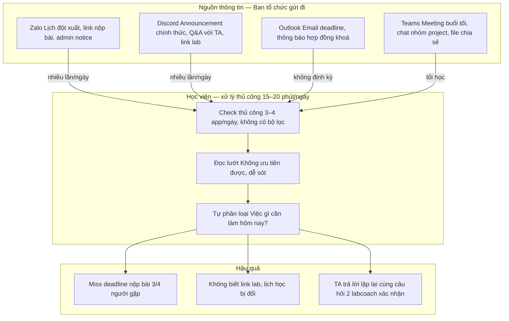
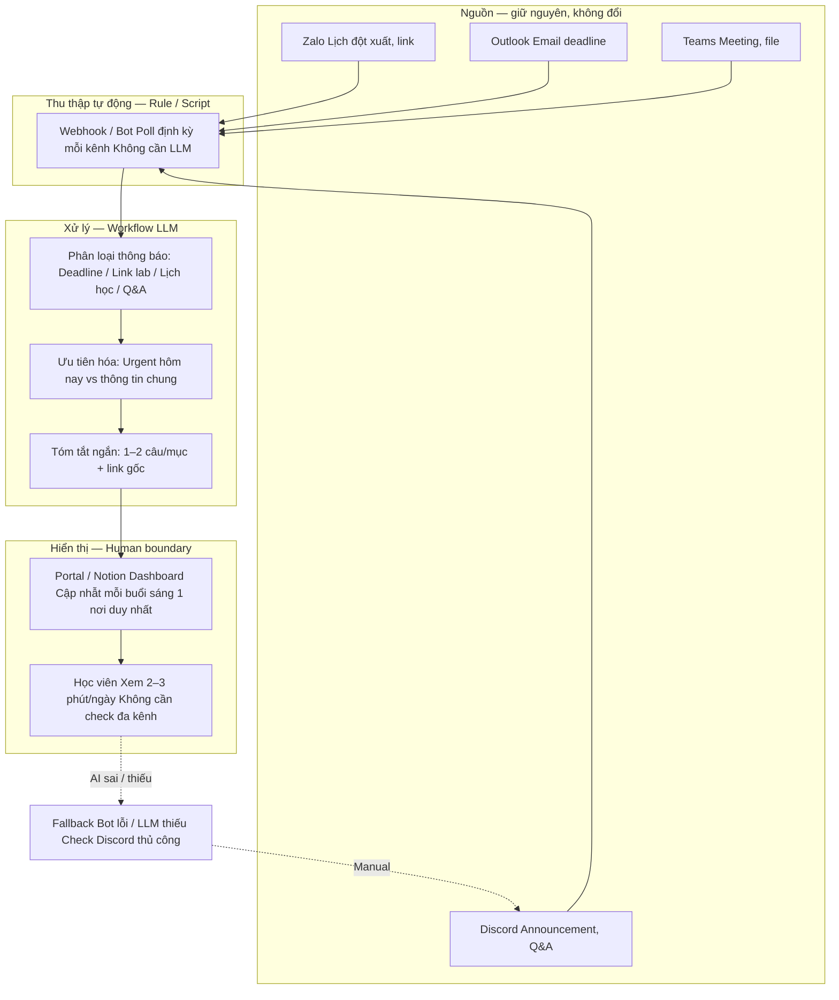

# 02-group-problem-statement

### Vương Sỹ Hạnh:

| Rank | Problem                              | Vì sao chọn                                                  | Điều còn chưa chắc                                                    |
| ---- | ------------------------------------ | ------------------------------------------------------------ | --------------------------------------------------------------------- |
| 1    | BOQ khách → đầu mục chuẩn + spec     | Workflow rõ, pain lớn nhất, nhiều format → **Agent/LLM**     | LLM gợi ý mã chuẩn hay bắt buộc khớp lookup cứng trước khi chấp nhận? |
| 2    | Tra catalog + tính công thức         | Tách khỏi LLM; **Rule/hard-code** dễ maintain                | Bao nhiêu % dòng vẫn cần nhập giá tay ngoại lệ?                       |
| 3    | BOQ đa ngôn ngữ → cần bản tiếng Việt | Gọi **LLM feature dịch** (Workflow), tách khỏi Agent card #1 | Thuật ngữ kỹ thuật dịch sai — ai chuẩn hóa từ điển PCCC?              |

### Khôi:

| **Rank** | **Problem**                                                                                                | **Vì sao chọn**                                                                                                              | **Điều còn chưa chắc**                                                                                  |
| -------- | ---------------------------------------------------------------------------------------------------------- | ---------------------------------------------------------------------------------------------------------------------------- | ------------------------------------------------------------------------------------------------------- |
| **1**    | **Học viên bị quá tải thông tin khóa học do rải rác trên quá nhiều kênh** (Zalo, Discord, Teams, Outlook). | Tần suất xuất hiện hàng ngày, ảnh hưởng trực tiếp đến trải nghiệm học. Cực kỳ thèm một giải pháp gom tụ thông tin.           | Làm sao cập nhật kịp thời khi ban tổ chức thay đổi lịch đột xuất trên một kênh bất kỳ.                  |
| **2**    | **Kẹt lỗi setup môi trường chạy code ban đầu nhưng TA không hỗ trợ kịp.**                                  | Đây là bottleneck lớn nhất khiến học viên bị nản ngay từ những bước đầu tiên làm Lab.                                        | Các lỗi phát sinh do phần cứng/hệ điều hành (Windows/Mac) quá đa dạng, khó chuẩn hóa dữ liệu lỗi.       |
| **3**    | **Biên bản họp nhóm Project buổi tối bị lan man, không chốt được task.**                                   | Giai đoạn làm Project buổi tối rất căng thẳng về thời gian. Giải quyết được bài này sẽ giúp đẩy nhanh tốc độ hội tụ ý tưởng. | Làm sao ghi nhận được đúng context/gợi ý của từng thành viên nếu họ nói đè chữ lên nhau khi họp online. |

Minh

| **Rank** | **Problem**                                                                            | **Vì sao chọn**                                            | **Điều còn chưa chắc**                      |
| -------- | -------------------------------------------------------------------------------------- | ---------------------------------------------------------- | ------------------------------------------- |
| 1        | Tìm lại quyết định labeling cho edge case từng được tranh luận trong Slack hoặc Notion | Workflow rõ, pain thật, AI fit mạnh nhất, dễ làm pilot nhỏ | Semantic search có đủ chính xác không       |
| 2        | QA khó phát hiện các object bị annotator bỏ sót trong frame đông                       | Impact trực tiếp lên chất lượng dataset và reject rate     | False positive và độ chính xác model        |
| 3        | Annotator mới liên tục hỏi lại rule occlusion dù guideline đã có sẵn                   | Pain lặp lại hằng ngày, dễ validate và scope phù hợp lab   | Guideline có đủ rõ để AI trả lời đúng không |

## **Group convergence**

| Cluster                                                                                                                                                                                | Candidate examples                                                                                                                                                                | Pattern chung |
| -------------------------------------------------------------------------------------------------------------------------------------------------------------------------------------- | --------------------------------------------------------------------------------------------------------------------------------------------------------------------------------- | ------------- |
| Chuẩn hóa dữ liệu phi cấu trúc & Tra cứu danh mục                                                                                                                                      | **• Hạnh #1**: BOQ khách → đầu mục chuẩn + spec.                                                                                                                                  |               |
| • **Hạnh #3**: BOQ đa ngôn ngữ → bản dịch tiếng Việt chuyên ngành.                                                                                                                     |                                                                                                                                                                                   |               |
| • **Minh #1**: Tìm lại quyết định labeling cho edge case từ Slack/Notion.                                                                                                              | • **Bản chất**: Tiếp nhận đầu vào nhiễu, nhiều format (file BOQ, đoạn chat, đa ngôn ngữ) và cần "đưa về một mối" chuẩn chỉnh.                                                     |               |
| • **Giải pháp**: Phối hợp LLM/Agent để đọc hiểu ngữ cảnh + hệ thống Lookup/Semantic Search để đối chiếu với nguồn dữ liệu gốc (Master data/Guideline/Từ điển chuyên ngành).            |                                                                                                                                                                                   |               |
| Gom tụ & Đồng bộ thông tin đa kênh                                                                                                                                                     | **• Khôi #1**: Học viên bị quá tải thông tin do rải rác đa kênh (Zalo, Discord, Teams...).                                                                                        |               |
| • **Khôi #3**: Trích xuất task và context từ biên bản họp nhóm (nói đè chữ, lan man).                                                                                                  | **• Bản chất**: Bài toán "nhiều nguồn, một đích". Thông tin bị phân mảnh theo thời gian thực và bất đối xứng về định dạng (văn bản đa kênh, giọng nói họp online).                |               |
| • **Giải pháp**: Xây dựng **Workflow/Pipeline kết nối** (Webhooks, STT) để thu thập dữ liệu liên tục, sau đó dùng LLM để **tóm tắt, phân loại và đồng bộ** về một dashboard tập trung. |                                                                                                                                                                                   |               |
| Trợ lý hỗ trợ & Kiểm định tự động                                                                                                                                                      | **• Minh #2**: QA phát hiện object bị bỏ sót trong frame đông.                                                                                                                    |               |
| • **Minh #3**: Giải đáp rule occlusion cho annotator mới dựa trên guideline.                                                                                                           |                                                                                                                                                                                   |               |
| • **Khôi #2**: Hỗ trợ fix lỗi setup môi trường chạy code khi TA quá tải.                                                                                                               | **• Bản chất**: Giải tỏa điểm nghẽn (bottleneck) trong vận hành hàng ngày bằng cách tự động hóa khâu kiểm tra hoặc trả lời lặp đi lặp lại.**Giải pháp**: Chia làm 2 nhánh rõ rệt: |               |

1. **Computer Vision (Model-based)** để quét và phát hiện lỗi sót (Minh #2).
2. **RAG/Knowledge Base** (Khôi #2, Minh #3) để "nuốt" guideline/lịch sử lỗi hệ điều hành và giải đáp tức thì cho user. |
| Tính toán công thức cố định |   **• Hạnh #2**: Tra catalog + tính công thức giá. |   • **Bản chất**: Bài toán thuần logic, yêu cầu độ chính xác tuyệt đối 100%, không chấp nhận sự "ảo giác" (hallucination) của AI.
  • **Giải pháp**: Cô lập hoàn toàn khỏi LLM. Sử dụng Rule-based/Hard-coded (Engine tính toán truyền thống) để dễ bảo trì và đảm bảo tính nhất quán. |

### **Shortlist và score**

| Candidate                                                                                                  | Actor rõ | Workflow rõ | Pain có evidence | Impact đo được | Làm trong lab | So sánh R/W/A được | Nhóm hiểu domain | Tổng |
| ---------------------------------------------------------------------------------------------------------- | -------- | ----------- | ---------------- | -------------- | ------------- | ------------------ | ---------------- | ---- |
| BOQ khách → đầu mục chuẩn + spec                                                                           | 5        | 5           | 4                | 4              | 1             | 5                  | 5                | 29   |
| **Học viên bị quá tải thông tin khóa học do rải rác trên quá nhiều kênh** (Zalo, Discord, Teams, Outlook). | 5        | 5           | 4                | 5              | 5             | 5                  | 5                | 34   |
| Tìm lại quyết định labeling cho edge case từng được tranh luận trong Slack hoặc Notion                     | 5        | 5           | 4                | 4              | 5             | 4                  | 5                | 32   |

Nhóm chọn: **Học viên bị quá tải thông tin khóa học do rải rác trên quá nhiều kênh** (Zalo, Discord, Teams, Outlook).

Vì sao chọn:

- Có workflow rõ nhất.
- Có baseline thời gian.
- Có thể validate nhanh với các học viên / labcoach khác.
- Có thể research các tool/pattern có sẵn.
- Có thể vẽ before/after rất rõ.

Vì sao không chọn các bài khác:

- **Tìm lại quyết định labeling cho edge case từng được tranh luận trong Slack hoặc Notion**: impact rộng nhưng data access phức tạp, dễ trượt sang hệ thống search/agent quá lớn.
- BOQ khách → đầu mục chuẩn + spec: workflow rõ nhưng quality metric khó thống nhất trong thời gian lab.

### **Quick validation**

Nhóm khảo sát nhanh học viên trong khóa học và lab coach.

| Nguồn                        | Số người / số mẫu | Tín hiệu xác nhận                                                                               | Tín hiệu phản bác                                                   | Nhóm sửa problem thế nào                                                                            |
| ---------------------------- | ----------------- | ----------------------------------------------------------------------------------------------- | ------------------------------------------------------------------- | --------------------------------------------------------------------------------------------------- |
| Quick interview với học viên | 4                 | 3/4 người từng bỏ sót deadline hoặc link lab vì thông tin nằm rải rác ở Discord, Teams, Outlook | 1 người nói đã tự tạo Notion cá nhân để quản lý nên ít bị ảnh hưởng | Thu hẹp problem: không phải “quản lý toàn bộ việc học”, mà là “gom và ưu tiên thông báo quan trọng” |
| Quick interview với labcoach | 2                 | Mentor phải trả lời lặp lại cùng một câu hỏi về deadline, link submit, lịch học                 | Một số câu hỏi do học viên không đọc announcement                   | Thêm boundary: hệ thống chỉ summarize và nhắc việc, không thay thế LMS/channels gốc                 |
| Mini poll trong lớp          | 8                 | 6/8 người check từ 3 nền tảng trở lên mỗi ngày để tránh miss thông báo                          | Một số người chỉ cần Discord là đủ                                  | Bổ sung non-AI alternative: dashboard tập trung + checklist thông báo                               |

Insight sau validation:

### **Research giải pháp**

Nhóm tìm các hướng đã có sẵn, không giả định phải tự build từ đầu.

| Nguồn / tool / case                                                                      | Link                                                                                                                                                                                                                                                                                                                         | Họ giải quyết phần nào?                                                                                                                                                                                                                                                                                            | Điểm mạnh                                                                                                                                                                                                                                                                                                                             | Khoảng trống / rủi ro                                                                                                                                                                                                                                                                                                       | Bài học cho nhóm                                                                                                                                                                                                                                                             |
| ---------------------------------------------------------------------------------------- | ---------------------------------------------------------------------------------------------------------------------------------------------------------------------------------------------------------------------------------------------------------------------------------------------------------------------------- | ------------------------------------------------------------------------------------------------------------------------------------------------------------------------------------------------------------------------------------------------------------------------------------------------------------------ | ------------------------------------------------------------------------------------------------------------------------------------------------------------------------------------------------------------------------------------------------------------------------------------------------------------------------------------- | --------------------------------------------------------------------------------------------------------------------------------------------------------------------------------------------------------------------------------------------------------------------------------------------------------------------------- | ---------------------------------------------------------------------------------------------------------------------------------------------------------------------------------------------------------------------------------------------------------------------------- |
| Conclude Apps trong Slack (digital workflows)                                            | [https://conclude.io/blog/stay-focused-information-overload/](https://conclude.io/blog/stay-focused-information-overload/)                                                                                                                                                                                                   | Tối ưu luồng trao đổi công việc trong Slack bằng cách tạo channel riêng cho từng ticket/vấn đề, giảm loạn tin và context switching. [conclude](https://conclude.io/blog/stay-focused-information-overload/)                                                                                                        | Tập trung mọi trao đổi về 1 việc vào 1 channel tạm thời, xong việc thì archive nhưng vẫn search được; giúp giảm “ngập” thông báo và phân tán thông tin giữa nhiều nơi. [conclude](https://conclude.io/blog/stay-focused-information-overload/)                                                                                        | Vẫn phụ thuộc vào Slack là kênh chính; nếu team song song dùng email, Zalo… mà không có quy ước rõ thì overload vẫn quay lại. Cần policy sử dụng kênh rất chặt. [conclude](https://conclude.io/blog/stay-focused-information-overload/)                                                                                     | Dùng chat app (Slack/Discord/Teams) như **một cổng chính**, tạo kênh chuyên đề (per-course, per-bài tập, per-vấn đề), đặt rule “mọi trao đổi về X chỉ nằm trong đúng 1 kênh đó”, hạn chế nhảy qua Zalo cá nhân.                                                              |
| Slack + Canvas trong lớp học MIT                                                         | [https://mitsloanedtech.mit.edu/2024/08/28/enhancing-active-learning-with-slack/](https://mitsloanedtech.mit.edu/2024/08/28/enhancing-active-learning-with-slack/)                                                                                                                                                           | Dùng Slack làm “backchannel” realtime cho hỏi đáp, thảo luận, còn Canvas giữ vai trò LMS chính (tài liệu, bài tập, grade). [mitsloanedtech.mit](https://mitsloanedtech.mit.edu/2024/08/28/enhancing-active-learning-with-slack/)                                                                                   | Rõ ràng vai trò mỗi hệ thống: Canvas = content & assignment; Slack = tương tác, Q&A, cộng đồng. Tận dụng search, thread, channel theo chủ đề giúp học viên dễ tìm lại thông tin. [mitsloanedtech.mit](https://mitsloanedtech.mit.edu/2024/08/28/enhancing-active-learning-with-slack/)                                                | Nếu không hướng dẫn kỹ cho SV “câu hỏi loại nào ở Slack, loại nào ở LMS/email” thì vẫn bị trùng lặp, bỏ sót thông tin quan trọng (deadline, announcement). [mitsloanedtech.mit](https://mitsloanedtech.mit.edu/2024/08/28/enhancing-active-learning-with-slack/)                                                            | Tách bạch: chọn **1 nơi chứa “single source of truth”** (LMS/Notion) cho syllabus, deadline, tài liệu; chat (Zalo/Discord/Teams) chỉ dùng cho hỏi đáp, thảo luận, hỗ trợ nhanh. Document rõ rule này ngay từ buổi đầu.                                                       |
| Slack trong seminar & project-based courses (nghiên cứu UCD)                             | [https://journals.sagepub.com/doi/pdf/10.1177/00472395231151910](https://journals.sagepub.com/doi/pdf/10.1177/00472395231151910)                                                                                                                                                                                             | Nghiên cứu định lượng việc dùng Slack trong khóa học: activity cả kỳ, dùng public/private channel, tạo “team spirit” và kênh giao tiếp xuyên suốt giữa giảng viên – SV. [journals.sagepub](https://journals.sagepub.com/doi/pdf/10.1177/00472395231151910)                                                         | Chứng minh được Slack giúp liên tục tương tác, minh bạch trao đổi (ai cũng thấy Q&A), hạn chế việc thông tin chỉ nằm trong email riêng lẻ. Đề xuất rõ: tạo nhiều channel theo mảng module, quy định thời gian phản hồi,… [journals.sagepub](https://journals.sagepub.com/doi/pdf/10.1177/00472395231151910)                           | Dễ trượt sang “ping overload” nếu tất cả đều vào một kênh chung hoặc không có guideline về thời gian/độ ưu tiên; người học bị áp lực phải “online liên tục”. [journals.sagepub](https://journals.sagepub.com/doi/pdf/10.1177/00472395231151910)                                                                             | Trong Discord/Teams của khóa: tạo **channel theo cấu trúc khóa** (announcements, Q&A chung, từng nhóm / từng project) và quy ước thời gian trả lời, tránh “always-on”. Pinned message hướng dẫn rõ.                                                                          |
| Best practices tích hợp LMS với hệ thống khác (Learning Guild + các bài LMS integration) | [https://www.learningguild.com/articles/follow-lms-integration-best-practices-for-long-term-success](https://www.learningguild.com/articles/follow-lms-integration-best-practices-for-long-term-success) [learningguild](https://www.learningguild.com/articles/follow-lms-integration-best-practices-for-long-term-success) | Thiết kế LMS làm trung tâm, rồi tích hợp SSO, HRIS, CRM, các hệ khác để dữ liệu và access tập trung, thay vì học viên phải đi qua nhiều cổng khác nhau. learningguild+1                                                                                                                                            | Nhấn mạnh đánh giá nhu cầu, xác định requirement (SSO, reporting, forum, mobile, UI tùy biến…) và viết kịch bản thực tế để test vendor; khuyến nghị dùng LMS làm nền tảng chính, tích hợp thông báo và data từ chỗ khác vào. learningguild+1                                                                                          | Nếu chọn LMS phức tạp, thiếu budget vận hành, hoặc không có người “sở hữu” hệ thống thì dễ thành thêm 1 kênh mới gây quá tải, thay vì giảm kênh. [learningguild](https://www.learningguild.com/articles/follow-lms-integration-best-practices-for-long-term-success)                                                        | Dù chưa có LMS enterprise, nhóm vẫn có thể coi **Notion / Moodle / Google Classroom** là “LMS light” và thiết kế xung quanh nó (SSO với Google, embed link buổi học, form, tài liệu). Mọi thông báo chính đều xuất phát từ đây, các kênh khác chỉ là “mirror” hoặc reminder. |
| Digital workplace platform (eXo Platform) – chống “information splitting”                | [https://www.exoplatform.com/blog/information-overload-solutions-to-regain-control/](https://www.exoplatform.com/blog/information-overload-solutions-to-regain-control/)                                                                                                                                                     | Mô hình “digital workplace” gom email, chat, document, app vào một cổng, giảm việc thông tin bị chia nhỏ giữa nhiều nơi. [exoplatform](https://www.exoplatform.com/blog/information-overload-solutions-to-regain-control/)                                                                                         | Chỉ ra rõ nguyên nhân chính: thông tin bị chia tán giữa email, IM, tài liệu share, meeting,… và gợi ý dùng 1 digital workplace để centralize, cộng thêm kỹ thuật batching, lọc thông tin, quyền “được ngắt kết nối”. [exoplatform](https://www.exoplatform.com/blog/information-overload-solutions-to-regain-control/)                | Xây digital workplace tốn effort; nếu tổ chức nhỏ / lớp học không duy trì được thì hệ thống nhanh chóng trở nên cồng kềnh. Cần tối giản, nếu không sẽ chỉ thêm một lớp phức tạp. [exoplatform](https://www.exoplatform.com/blog/information-overload-solutions-to-regain-control/)                                          | Dùng tư duy “digital workplace” ở scale nhỏ: làm **một portal duy nhất** (Notion page / website khóa học) link tới tất cả: group Zalo, Discord, Teams meeting, tài liệu. Dạy học viên: “bất cứ khi nào lạc, quay về portal này trước”.                                       |
| TechClass – Curating learning content & dùng Notion/Trello/Drive làm cấu trúc            | [https://www.techclass.com/resources/lifelong-learning/how-to-avoid-information-overload-curating-learning-content-effectively](https://www.techclass.com/resources/lifelong-learning/how-to-avoid-information-overload-curating-learning-content-effectively)                                                               | Gợi ý dùng công cụ như Notion, Trello, Google Drive folder để tổ chức nội dung học theo chủ đề (ví dụ: “Career skills”, “Projects”), giúp người học bớt ngập thông tin. [techclass](https://www.techclass.com/resources/lifelong-learning/how-to-avoid-information-overload-curating-learning-content-effectively) | Tập trung vào **curation** và cấu trúc rõ ràng: thư mục/bảng cho từng mục tiêu học, thay vì quăng link rải rác; nhấn mạnh một “trục dọc” để người học luôn biết đang ở đâu trong lộ trình. [techclass](https://www.techclass.com/resources/lifelong-learning/how-to-avoid-information-overload-curating-learning-content-effectively) | Cần kỷ luật cập nhật; nếu giảng viên / admin không thường xuyên dọn dẹp, portal vẫn loạn. Người học cá nhân nếu không được hướng dẫn thì lại quay về lưu link rời rạc trên chat. [techclass](https://www.techclass.com/resources/lifelong-learning/how-to-avoid-information-overload-curating-learning-content-effectively) | Thiết kế **curriculum map** trong Notion/Trello: mỗi module = 1 card/page chứa: link tài liệu, link video, link thread Q&A, link buổi live. Luôn share lại đúng 1 link này, không gửi từng link lẻ trên Zalo/Discord.                                                        |
| Khóa e-training về digital information overload (PINKTUM)                                | [https://www.pinktum.com/en/macrolearnings/overcoming-the-digital-information-overload/](https://www.pinktum.com/en/macrolearnings/overcoming-the-digital-information-overload/)                                                                                                                                             | Đào tạo kỹ năng cá nhân để quản lý overload: lọc thông tin, quản lý inbox, dùng công cụ số hiệu quả, giữ “digital balance”. [pinktum](https://www.pinktum.com/en/macrolearnings/overcoming-the-digital-information-overload/)                                                                                      | Nhấn mạnh góc độ **kỹ năng người học**, không chỉ công cụ: tiêu chí chọn thông tin, kỹ thuật tăng tập trung, chiến lược dùng bớt kênh. [pinktum](https://www.pinktum.com/en/macrolearnings/overcoming-the-digital-information-overload/)                                                                                              | Nếu tổ chức chỉ “đẩy” content về kỹ năng mà không đổi quy trình/kênh, người học vẫn bị system-level overload (quá nhiều kênh, rule mơ hồ). [pinktum](https://www.pinktum.com/en/macrolearnings/overcoming-the-digital-information-overload/)                                                                                | Bên cạnh thiết kế hệ thống, nên có **mini-module onboarding** cho học viên: “Cách sống sót với hệ thống thông tin của khóa này” – demo cách mute kênh, đặt filter, tổng hợp weekly, v.v.                                                                                     |

### **Workflow before/after**

#### CURRENT STATE — Quá tải thông tin (mỗi ngày)

#### FUTURE STATE — Workflow tập trung (AI-assisted)

**Before/after impact:**

| Metric                  | Trước           | Sau kỳ vọng                    | Ghi chú                                            |
| ----------------------- | --------------- | ------------------------------ | -------------------------------------------------- |
| Số nền tảng phải check  | 3–4             | 1                              | Portal tập trung                                   |
| Thời gian tổng hợp/ngày | 15–20 phút      | 2–3 phút                       | LLM summarize                                      |
| Tỷ lệ miss thông báo    | Cao (3/4 người) | Giảm đáng kể                   | Cần đo lại sau pilot                               |
| Bước thủ công           | 4/4             | 1/4                            | Human chỉ đọc + confirm                            |
| Risk mới                | Không có        | Hallucination, thiếu thông báo | Cần human review                                   |
| Mức AI chọn             | —               | **Workflow**                   | Rule/script lấy data, LLM draft summary, người đọc |

### **Problem Statement v0**

| Field          | Nội dung                                                                                                                                                               |
| -------------- | ---------------------------------------------------------------------------------------------------------------------------------------------------------------------- |
| Actor          | Học viên tham gia khóa học/lab sử dụng nhiều kênh như Zalo, Discord, Outlook để theo dõi thông tin học tập.                                                            |
| Workflow       | Mỗi ngày học viên phải tự mở nhiều kênh để đọc thông báo, tìm link lab/tài liệu, kiểm tra deadline, theo dõi lịch học và hỏi lại trong group khi không chắc thông tin. |
| Bottleneck     | Bước tự tổng hợp và xác nhận thông tin mất nhiều thời gian vì thông tin bị phân tán, cập nhật liên tục và không có nơi ưu tiên nội dung quan trọng.                    |
| Impact         | Học viên mất khoảng 45–60 phút/ngày để kiểm tra thông tin; dễ bỏ sót deadline hoặc link quan trọng; labcoach bị hỏi lặp lại nhiều lần cùng nội dung.                   |
| Success Metric | Giảm thời gian tìm và tổng hợp thông tin xuống dưới 15 phút/ngày; giảm số câu hỏi lặp lại trong group; giảm tình trạng miss deadline/lab.                              |
| Boundary       | Không tự thay thế nguồn thông tin gốc; không tự quyết định nội dung học tập; AI chỉ có vai trò tổng hợp, ưu tiên và nhắc nhở để học viên review lại.                   |

### **Rule / Workflow / Agent**

| Mức      | Phương án                                                                                                          | Khi nào đủ                                                                  | Rủi ro                                                          | Chọn?                                                       |
| -------- | ------------------------------------------------------------------------------------------------------------------ | --------------------------------------------------------------------------- | --------------------------------------------------------------- | ----------------------------------------------------------- |
| Rule     | Gom announcement từ Discord/Zalo/Teams vào một dashboard cố định; filter theo tag như “deadline”, “lab”, “meeting” | Đủ nếu học viên chỉ cần xem lại thông báo theo thời gian                    | Không giải quyết việc hiểu context hoặc tóm tắt nội dung dài    | Không chọn làm toàn bộ, nhưng dùng cho bước đồng bộ dữ liệu |
| Workflow | Auto-sync thông báo đa kênh → AI phân loại → AI tóm tắt & highlight task/deadline → học viên review                | Hợp vì workflow tuyến tính, AI chủ yếu hỗ trợ đọc hiểu và tóm tắt thông tin | AI có thể bỏ sót deadline hoặc summarize sai context            | Chọn                                                        |
| Agent    | Agent tự đọc mọi kênh, tự nhắc học viên, tự trả lời câu hỏi, tự ưu tiên task                                       | Chỉ cần nếu muốn hệ thống chủ động thay người dùng quyết định và follow-up  | Scope quá lớn, cần nhiều permission và dễ gây spam/sai nhắc nhở | Chưa chọn                                                   |

Mức chọn: Workflow

Vì sao:

- Việc lấy dữ liệu từ Discord/Zalo/Teams có thể xử lý bằng rule/script hoặc webhook.
- Pain chính nằm ở việc thông tin bị phân tán và khó đọc lại nhanh → phù hợp để AI tóm tắt và cấu trúc.
- Học viên vẫn là người quyết định hành động cuối cùng nên rủi ro thấp hơn.
- Chưa cần Agent vì workflow hiện tại khá tuyến tính, chưa cần AI tự lập kế hoạch hay tự ra quyết định

### **Problem Statement v1**

| Field                        | Nội dung                                                                                                                                                                        |
| ---------------------------- | ------------------------------------------------------------------------------------------------------------------------------------------------------------------------------- |
| Actor                        | Học viên tham gia khóa học/lab phải theo dõi thông tin từ nhiều kênh như Zalo, Discord, Outlook và chat nhóm.                                                                   |
| Workflow                     | Mỗi ngày học viên mở nhiều kênh → đọc thông báo → tìm link/lịch/deadline → tự tổng hợp → hỏi lại trong group nếu chưa chắc → tiếp tục học/làm lab.                              |
| Bottleneck                   | Việc tự tổng hợp và xác nhận thông tin từ nhiều nguồn mất nhiều thời gian, dễ bỏ sót nội dung quan trọng hoặc nhầm deadline khi thông tin cập nhật liên tục.                    |
| Impact                       | Khoảng 45–60 phút/ngày/học viên; dễ miss deadline hoặc link lab; labcoach và nhóm bị interrupt bởi nhiều câu hỏi lặp lại.                                                       |
| Success Metric               | Giảm thời gian tìm/tổng hợp thông tin xuống dưới 15 phút/ngày; giảm số câu hỏi lặp lại trong group; giảm tình trạng bỏ sót deadline/lịch học.                                   |
| Boundary                     | AI không thay thế nguồn thông tin gốc; không tự quyết định nội dung học tập; không tự gửi thông báo thay ban tổ chức; học viên vẫn là người kiểm tra cuối cùng.                 |
| AI intervention point        | Sau khi dữ liệu từ Zalo/Discord/Outlook được gom lại, trước bước học viên tự đọc và tổng hợp thủ công.                                                                          |
| Mức chọn                     | Workflow: collect dữ liệu đa nguồn bằng rule/integration, AI phân loại & draft digest/reminder, học viên review và hành động.                                                   |
| Rủi ro & người thật kiểm tra | Risk: AI summarize sai context, bỏ sót thông báo quan trọng hoặc ưu tiên sai deadline. Người thật kiểm tra: học viên phải review digest và có thể mở lại nguồn gốc để xác minh. |

**Final decision**

**Decision:**

- Go với scope nhỏ.
- Ưu tiên validate workflow trước khi build hệ thống hoàn chỉnh.

**Pilot nhỏ nhất:**

- Dùng data mẫu từ 2 tuần học gần nhất.
- Chạy workflow bán thủ công:
  - Học viên paste announcement/update từ Discord, Teams, Outlook vào prompt chuẩn.
  - AI draft summary, deadline và action items.
  - Học viên review trước khi sử dụng.
- Đo:
  - Thời gian tổng hợp thông tin.
  - Số lần phải hỏi lại Lab Coach.
  - Số deadline/task bị miss.

**Exit / rollback:**

- Nếu học viên vẫn phải đọc lại hơn 70% nội dung gốc trong 2 tuần liên tiếp → hạ xuống dashboard + filter notification đơn giản.
- Nếu AI summarize sai deadline hoặc sai context quan trọng → không dùng output trực tiếp.
- Nếu workflow không giảm rõ thời gian tổng hợp → dừng hướng AI narrative.

**Decision rationale:**

- Problem rõ:
  - Thông tin khóa học bị phân tán trên nhiều kênh.
- Workflow rõ:
  - Thu thập update → gom dữ liệu → AI summarize → học viên review.
- Metric rõ:
  - Giảm thời gian tổng hợp thông tin.
  - Giảm số lần bỏ sót deadline.
- Có non-AI components:
  - Sync dữ liệu, filter, tagging bằng rule/script.
- AI chỉ nằm ở một bước cụ thể:
  - Tóm tắt và highlight thông tin quan trọng.
- Human review rõ:
  - Học viên vẫn là người kiểm tra và quyết định hành động cuối cùng.

